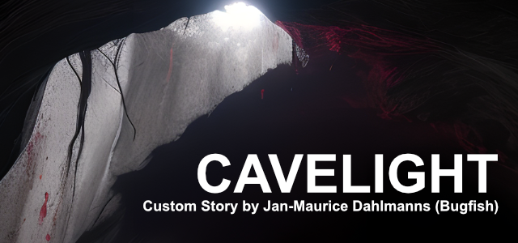

# Amnesia: Cavelight

## Introduction

**Amnesia: Cavelight** is a custom story designed specifically for **Amnesia: The Bunker**. This version of the Amnesia series, set in a dark and immersive World War I bunker, provides a gripping environment for horror and exploration. **Cavelight** leverages the unique features and atmospheric tension of **Amnesia: The Bunker**, offering players an intense, suspenseful experience that fits seamlessly within the game’s existing mechanics and storyline. As you navigate through claustrophobic corridors and unravel a new narrative, the custom story enhances the base game’s horror elements with fresh content, custom maps, and an original storyline. If you're a fan of Amnesia’s psychological horror and immersive gameplay, **Cavelight** is crafted to extend the experience with its own eerie twists and mysteries.



<br clear="both">

## Repository Structure

| Folder     | Description                                          |
|------------|------------------------------------------------------|
| .github    | Internal GitHub template files.                              |
| _images    | Images to use in README Files.            |
| _release   | Release packages.                                    |
| _source | Source Code of the Custom Story Game Mod                               |
| docs       | Framework documentation and also this project's GitHub page. You can find all functions and classes of this framework explained there!            |


## Installation

1. **Clone or Download the Repository:**
	- If you are using Git, clone the repository using:
     ```sh
     git clone https://github.com/bugfishtm/Amnesia-Cavelight
     ```
	- Alternatively, you can download the release versions in the _releases folder as a ZIP file from the repository page and extract it to a location of your choice.


2. **Install the Custom Story:**
	- Copy the `Cavelight` folder from the `_source` directory.
	- Navigate to your Amnesia: The Bunker installation directory.
	- Open the `mods` directory within the Amnesia installation folder.
	- Paste the `Cavelight` folder into the `mods` directory.


3. **Start Amnesia: The Bunker:**
	- Open the game and go to the **"Custom Stories"** menu.
	- You should see **Cavelight** listed. Enable it to start the custom story.
	- Enable the Custom Story and start a New Game.

## Troubleshooting

- **Custom Story Not Appearing:**
	- Make sure you placed the `Cavelight` folder directly inside the `mods` directory.
	- Ensure that the folder structure is correct and that the `Cavelight` folder is not nested inside another folder.

- **Game Crashes or Errors:**
	- Verify that you are using a compatible version of Amnesia for the custom story.
	- Check the repository or community forums for updates or patches.

## License Information

**Amnesia: Cavelight** is a custom story for **Amnesia: The Bunker** and complies with Frictional Games' license terms. The custom story itself is licensed under the GNU General Public License v3.0 (GPLv3). This means you are free to modify and distribute the story as long as you adhere to the same licensing terms.

Please note that while the custom story is under GPLv3, the files included in this repository may be subject to various Creative Commons or open-source licenses. Always check the specific license information provided with each file to ensure proper use and attribution.

For more details on Frictional Games' licensing, please refer to their official website or game documentation.